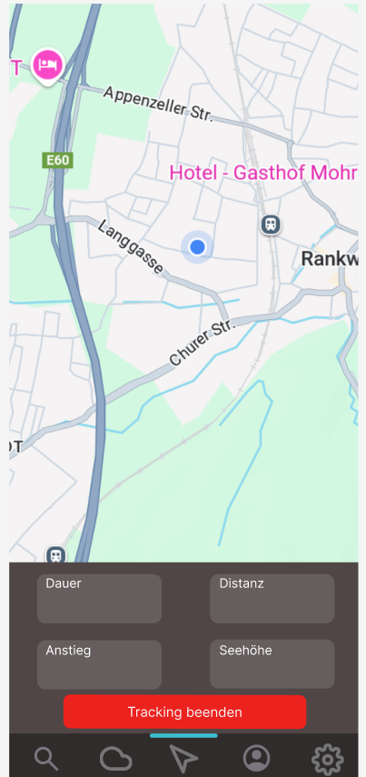

## Projekttitel

- HikeMate

## Kurzbeschreibung
HikeMate ist eine Wander-App, die Touren mit GPS trackt, Berge aus Österreich anzeigt, Statistiken speichert und Wetterdaten liefert. Nutzer können ihre Aktivitäten verwalten, bereits bestiegene Berge abhaken und erhalten Live-Daten zu Strecke, Anstieg und Kalorien. Die App basiert auf Flutter, PostgreSQL und bietet ein sicheres Login-System mit Admin/User-Rollen.

## Github Link

https://github.com/EdgeLordE/HikeMate

## Arbeitsaufteilung (sofern vorhanden)
noch nicht vorhanden

## Alles was ihr bisher in diese Richtung erledigt habt / Softwarekonzept

**ER-Diagramm**:

**Klassendiagramm**:

### UI-SKizzen

- LandingPage, wo man sieht wo man ist und das Tracking starten kann

- Tracking gestartet

- Berg suchen Page

- ProfilPage
  

- EinstellungenPage
  

- WetterPage
  

- LoginPage
  

- RegristrierenPage
  

### Installationen

Wir haben alles installiert und könen mit dem Programmieren anfangen(Android Studio)
