# Umsetzungsdetails

## Welche Softwarevoraussetzungen werden benötigt (mit Versionen)?
- Backend: für das Backend braucht man eigentlich garnix wenn man es auf dem Handy laufen lässt, da man auf einen Server zugreift, der die Swagger Datei ausführt.
- Backend (selber ausführen):
  - python: 3.5.2+
  - connexion >= 2.6.0
  - connexion[swagger-ui] >= 2.6.0
  - swagger-ui-bundle >= 0.0.2
  - python_dateutil == 2.6.0
  - setuptools >= 21.0.0
  - supabase 
  - bcrypt
  - pytest
  - coverage
  - tox
  - flask-testing
- Frontend (eigentlich nichts außer man will es von dem PC ausführen mit der apk braucht man nichts):
  - Flutter SDK 3.0+
  - DartSDK 3.0+
  - Android SDK 21+
  - Android NDK 27.0.12077973
  - CMake 3.22.1+
  - Gradle 8.0+
  - Packages:
    -   url_launcher: ^6.1.7
    -   flutter_local_notifications: ^19.2.1
    -   flutter_local_notifications_linux: ^6.0.0
    -   timezone: ^0.10.1
    -   analyzer: ^6.2.0
    -   cupertino_icons: ^1.0.8
    -   flutter_map: ^6.0.1
    -   latlong2: ^0.9.0
    -   geolocator: ^10.1.0
    -   flutter_map_location_marker: ^8.0.5
    -   shared_preferences: ^2.0.15
    -   flutter_background: ^1.0.0
    -   permission_handler: ^11.0.1
    -   supabase: ^1.0.0
    -   bcrypt: ^1.1.3
    -   process_run: ^0.12.0
    -   http: ^1.4.0
    -   share_plus: ^7.2.1
    -   charts_flutter: ^0.12.0
    -   csv: ^5.0.0
    -   path_provider: ^2.0.11
    -   logging: ^1.1.0
   

## Funktionsblöcke bzw. Architektur
Es war ein 3 Schichtenmodell:

- Datenbank: Hier wurde die Supabase Datenbank erstellt, die die Daten speichert und
- Backend: Hier wurde die Swagger Datei erstellt, die die Endpunkte für die Datenbank bereitstellt. Diese Datei wurde dann auf einem Server ausgeführt, der die Anfragen entgegennimmt und die Datenbank abfragt.
- Frontend: Hier wurde die Flutter App erstellt, die die Endpunkte der Swagger Datei aufruft und die Daten anzeigt. Die App wurde so gestaltet, dass sie auf Android Handys läuft und auch auf dem PC gestartet werden kann.


### Frontend Architektur
```
src/frontend/lib/
├── main.dart
│
├── Class/
│   ├── Activity.dart
│   ├── Done.dart
│   ├── LocationTracker.dart
│   ├── Logging.dart
│   ├── Mountain.dart
│   ├── supabase_client.dart
│   ├── TrackingStorage.dart
│   ├── User.dart
│   ├── Watchlist.dart
│   └── diagramm_analyzer.dart
│
├── Pages/
│   ├── HomePage.dart
│   ├── LoginPage.dart
│   ├── RegistrationPage.dart
│   ├── SearchMountainPage.dart
│   ├── WeatherPage.dart
│   ├── NavigationPage.dart
│   ├── ProfilePage.dart
│   ├── DonePage.dart
│   ├── ChangePasswordPage.dart
│   ├── ChangeUsernamePage.dart
│   ├── settings_page.dart
│   ├── emergency_page.dart
│   └── checkin_service.dart
│
└── test/
    ├── activity_test.dart
    ├── done_test.dart
    ├── location_tracker_test.dart
    ├── mountain_test.dart
    ├── tracking_storage_test.dart
    ├── user_test.dart
    └── watchlist_test.dart
```

### Backend Architektur

**Architektur des Backends:**
sind aber nur die wichtigsten Dateien aufgelistet.
```
src/Backend/
├── .vscode/
│   └── settings.json
│
├── python_flask_server/
│   ├── start_server.py
│   │
│   └── swagger_server/
│       ├── controllers/
│       │   ├── login_regristration_controller.py
│       │   ├── activity_controller.py
│       │   ├── mountain_controller.py
│       │   ├── done_mountains_controller.py
│       │   ├── watchlist_controller.py
│       │   └── federal_state_controller.py
│       │
│       ├── models/
│       │   ├── user.py
│       │   ├── mountain.py
│       │   ├── activity.py
│       │   ├── done.py
│       │   ├── watchlist.py
│       │   └── federal_state.py
│       │
│       ├── test/
│       │   ├── test_done_mountains_controller.py
│       │   ├── test_mountain_controller.py
│       │   └── weitere Tests...
│       │
│       ├── swagger/
│       │   └── swagger.yaml
│
└── Skripte_Beger_suchen/
    ├── AT.txt
    ├── berge_at.csv
    ├── berge_mit_bildern_2.csv
    ├── berge_mit_bildern_direct_1.csv
    ├── berge_mit_bildern_direct.csv
    ├── berge_mit_bildern_urls.csv
    ├── berge_mit_bildern_vorschau.csv
    └── berge_mit_bildern.csv
```


## Detaillierte Beschreibung der Umsetzung

UI Design
Beim UI Design haben wir besonderen Wert auf eine intuitive und moderne Benutzeroberfläche gelegt. Bereits in der Planungsphase wurden erste Skizzen und Mockups erstellt, um die Navigation und die wichtigsten Funktionen übersichtlich darzustellen. Die Umsetzung erfolgte mit Flutter, wodurch wir eine einheitliche User Experience auf verschiedenen Geräten (Android und Desktop) gewährleisten konnten.

Für die Hauptfunktionen wie Bergsuche, Navigation, Aktivitäten und Notfallfunktionen wurden eigene Seiten (Pages) entwickelt. Die Navigation zwischen den Seiten erfolgt über eine übersichtliche Tab-Bar. Farben, Icons und Schriftarten wurden so gewählt, dass die App auch bei längerer Nutzung angenehm bleibt und wichtige Aktionen schnell erreichbar sind.

### UI Design
So haben wir das UI Design umgesetzt:
- LoginPage:

- RegistrationPage:
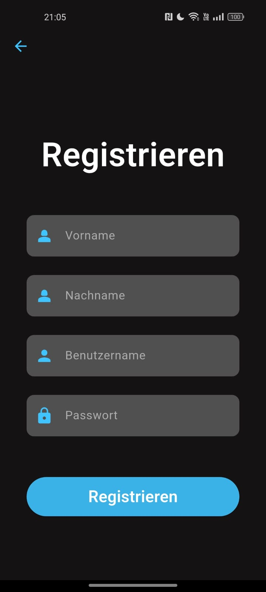
- HomePage:
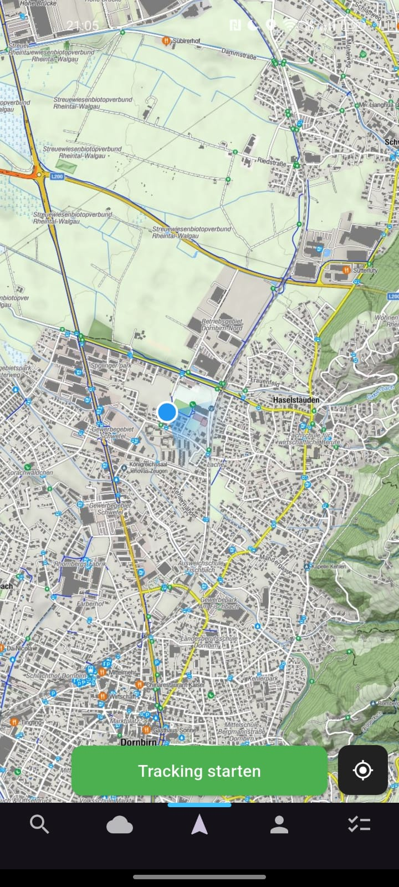
- SearchMountainPage:
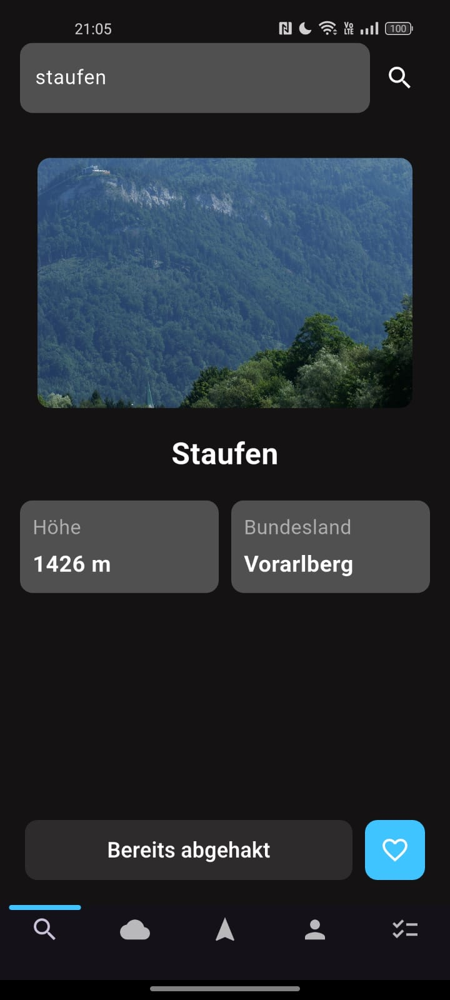
- WeatherPage:
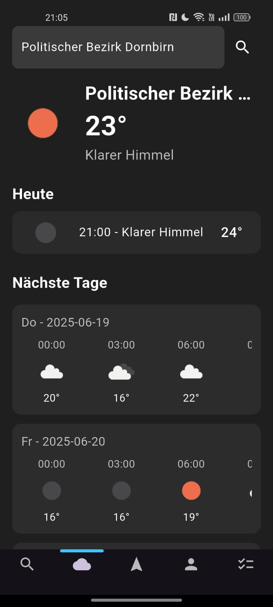
- ProfilePage:
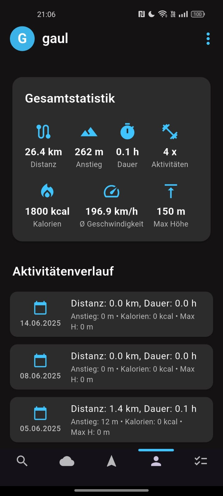
- DonePage:
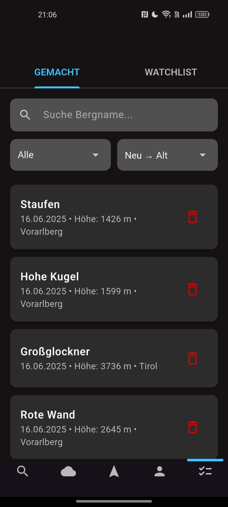
- WatchlistPage:
- 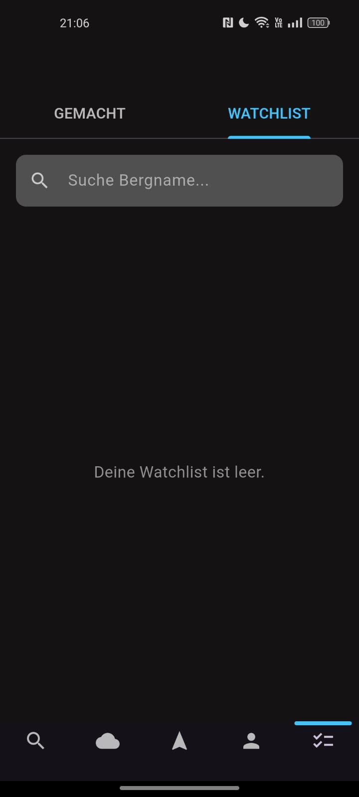
- SettingsPage:
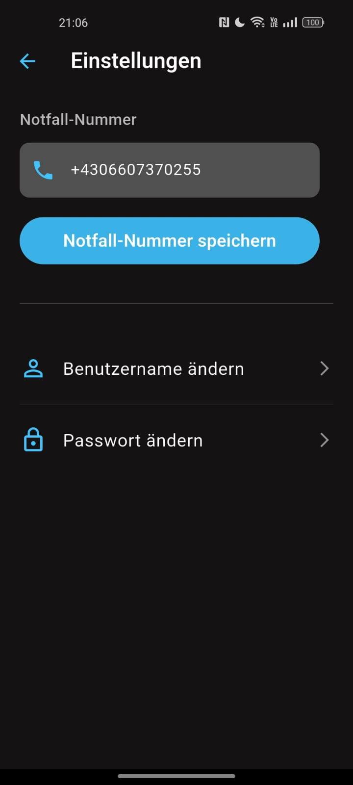


### Klassendiagramme und ER-Diagramme
- **Klassendiagramm:** Das am Anfang geplante Klassendiagramm, war sehr abweichend von dem, das wir dann am Ende umgesetzt haben. Das lag daran, da wir am Anfang nicht wirklich so weit denken konnten (wie z.B. das wir eine Klasse brauchen um alles zu speichern und ein Tracking Service) -> Was lernen wir daraus? Wir sollten schon von Anfang an sehr tiefgründig denken und planen.
    - Anfang: 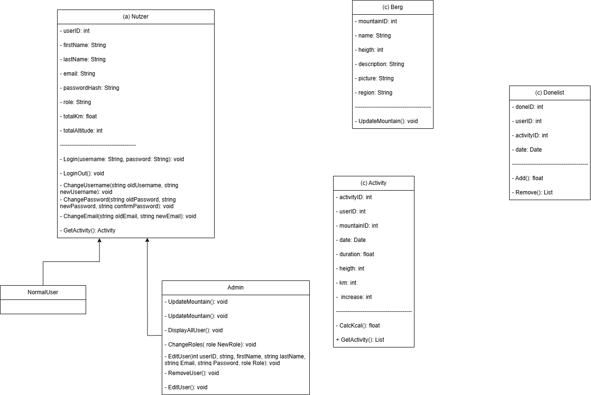
    - Ende: 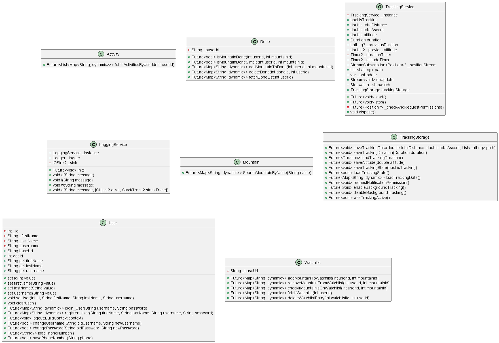
- **ER-Diagramm:** Das am Anfang geplante ER-Diagramm, war auch ziemlich das was wir am Ende dann auch umgesetzt haben. Der Hauptgrund für das war das es ziemlich einfach war und wir nicht wirklich viel am Anfang denken mussten es war ziemlich einfach aufgebaut.
  - Anfang: 
  - Ende: 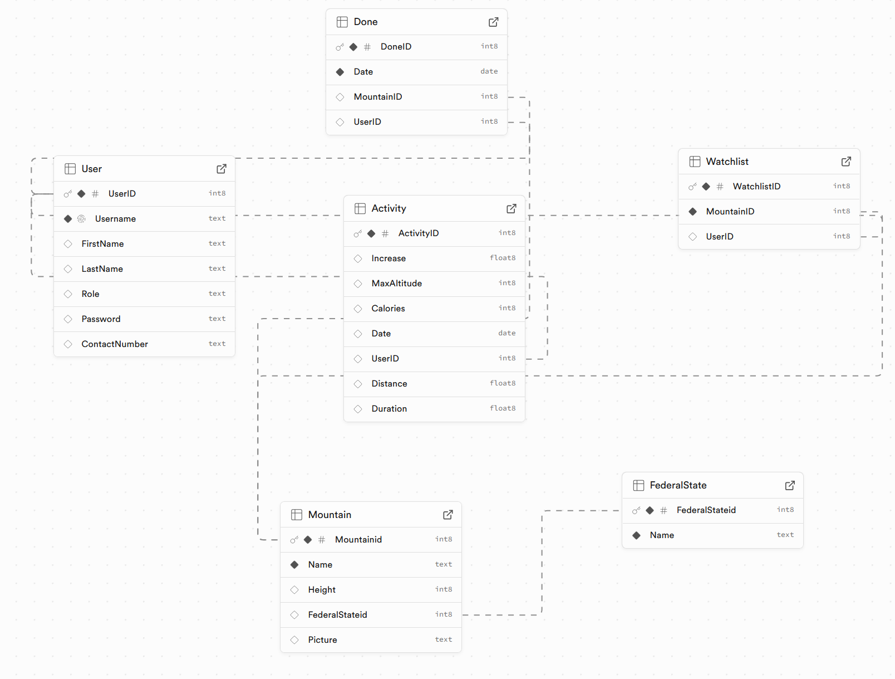


## Mögliche Probleme und ihre Lösung

| Problem | Lösung |
|---------|--------|
| Wie kann ich dauerhaft auf die Datenbank mit der selben IP zugreifen? | Wir haben einen Server gemietet, der eine öffentliche IP-Adresse hat, bei dem haben wir unser Repository auch hinterlegt und pullen dort immer die neusten Änderungen. Damit es auch immer dauerhaft läuft haben wir tmux benutzt, um die Python-Datei dauerhaft laufen zu lassen. |
| Wie kann ich im Hintergrund die App laufen lassen, dass alles richtig getrackt wird? | Wir haben das flutter_background Package benutzt, um die App im Hintergrund laufen zu lassen. |
| Wie bekomme ich alle Bilder von den Bergen in ganz Österreich? | Zuerst CSV mit allen Bergen aus Österreich erstellt. Dann Skript geschrieben, das auf Wikimedia den Namen des Berges sucht und das Bild als URL in die CSV-Datei schreibt. Diese Datei wurde dann in die Datenbank importiert. |
| Unit Tests für existierende Klassen schreiben | Klassen mussten umgebaut werden (z.B. Abhängigkeiten injizierbar machen) um Tests schreiben zu können. Aufwand: Refactoring vor Test-Implementierung war nötig. |
| Permission-Handling (SMS & Standort) korrekt implementieren | Android Runtime Permissions für SMS (SOS) und GPS (Tracking) korrekt angefordert und behandelt. iOS: Explizite Privacy Usage Descriptions geschrieben. App prüft zur Laufzeit ob Berechtigungen noch aktiv sind und leitet Nutzer zur Wiederaktivierung weiter falls nötig. |
| SOS-Funktionalität im Hintergrund zuverlässig ausführen | Intervall-Trigger und direkte Notruf-Funktion im Hintergrund-Service implementiert. Problem mit Android Doze-Mode durch Whitelisting gelöst. Extensive Tests auf verschiedenen Geräten durchgeführt. |


## Wie wurde die Software getestet?
- Backend: Die Software wurde mit Swagger-UI zu oft getestet und durch das dauerhafte Testen der App wurden sie immer getestet und auch fehler wurden so gefunden. Nicht nur das sondern wir haben auch im Swagger_server unter tests für jeden Controller und für jede Funktion in diesem Controller Tests geschrieben, die dann mit einem befehl ausgeführt werden können.
- Frontend: Die Software wurde laufend immer mit einem Android Handy getetstet und auch auf mehreren Android Handys, um so die Kompatibilität zu testen. Auch wurde die App auf dem Pc selber oft gestartet und somit auch getestet, so haben wir auch einige Fehler gefunden, die dann behoben wurden. Auch hier im Frontend haben wir für jede Klasse und für jede Funktion in der Klasse unittest geschrieben.

## Dokumentation
- Backend: im Backend haben wir die Controllers mit doxygen dokumentiert und mit dem eine html Datei erstellen können. Auch haben wir die swagger.yaml Datei nocheinmal überarbeitet, sodass die description besser und auch das Beispiele vorhanden sind. Auch wurden die schemas am Schluss überarbeitet, sodass diese auch gut dokumentiert sind. Bei der Dokumentation wurde viel mit KI gearbeitet, da es sonst nur schreibarbeit gewesen wäre.
- Frontend: Im frontend wurde die Dokumentation mit dartdoc durchgeführt, sodass eine html Datei erstellt werden kann. Auch wurde hier die Dokumentation der Klassen und Funktionen verbessert, sodass diese auch gut dokumentiert sind
